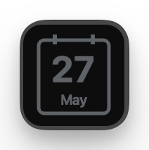
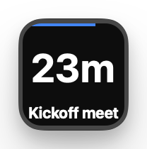
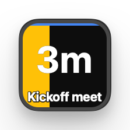
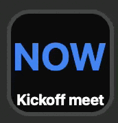
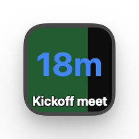
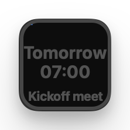
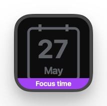
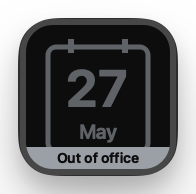

<p align="center">
  <picture>
    <source media="(prefers-color-scheme: dark)" srcset="docs/logo-dark.svg">
    
  </picture>
</p>

A [Stream Deck](https://www.elgato.com/stream-deck) plugin that turns a key
into a live indicator for your Google Calendar. The key shows a countdown to
the next meeting (or remaining time in the current one), with a progress bar
across the top, a yellow fill in the last few minutes before it starts, and a
footer band for out-of-office or focus-time overlaps. Press the key to join
the current meeting, open the meeting URL in a chosen app, or open the next
meeting's notes doc.

## Features

|                                                                   |                                                                                                      |
| :---------------------------------------------------------------: | ---------------------------------------------------------------------------------------------------- |
|          | **Idle.**<br>Nothing on the calendar today any time soon.                                            |
|        | **Countdown to the next meeting.**<br>Time remaining, with a blue bar.                               |
|         | **Imminent.**<br>In the last 5 minutes a yellow block gradually fills the key.                       |
|       | **Meeting starts.**<br>Flashes `NOW` until you press. Pressing opens the meeting.                    |
|  | **In the meeting.**<br>Time remaining, green bar shows time elapsed.                                 |
|   | **Beyond today.**<br>Distant events are dimmed, events tomorrow get time of day instead of countdown |
|        | **Focus time.**<br>Purple footer band, so you can still see the next regular meeting.                |
|     | **Out of office.**<br>Grey footer band so you can see the next meeting.                              |

### Multi-key sweep

https://github.com/user-attachments/assets/42d28e97-5eb9-4187-94fb-ffbc773e179a

Place two or more **Meeting countdown** (or **Upcoming meeting**) keys next
to each other and the yellow imminent-fill bar sweeps across them as a
single band in the last 5 minutes before a meeting. A much more visible cue
than a single key can give on its own.

Short press clears the flashing `NOW` and another joins the current meeting (Google Meet, Zoom, or Teams).
Long press opens the meeting's first attached doc, falling back to the
event detail page.

## Actions

|                                                                                         | Action                | What it shows                                                                                          |
| :-------------------------------------------------------------------------------------: | --------------------- | ------------------------------------------------------------------------------------------------------ |
|  | **Meeting countdown** | The ongoing meeting if you're in one, otherwise the next upcoming meeting. The "do everything" action. |
|   | **Upcoming meeting**  | Only the next upcoming meeting. Ignores meetings already in progress.                                  |
|    | **Ongoing meeting**   | Only the meeting you're currently in. Idle when nothing is happening.                                  |
|      | **Meeting alert**     | Blank tile that only lights up the moment a meeting starts. Short press dismisses, long press joins.   |

## Install (end users)

Download the latest `com.ewels.deckcal.streamDeckPlugin` from the
[releases page](https://github.com/ewels/deckcal/releases), double-click to
install in Stream Deck, drag **Meeting countdown** onto a key, click the
gear icon, and **Sign in with Google**.

No Google Cloud setup required. The OAuth client is bundled into the release
binary. The plugin authenticates against Google with a loopback PKCE flow
(RFC 8252) — credentials never leave your machine.

> While the OAuth app is in Google's **Testing** status, sign-in is
> restricted to test users on the app's allowlist. Open an issue if you
> want to be added. Long term, the app will go through Google verification
> so anyone can sign in.

## Building from source (developers)

```sh
npm install
cp .env.local.example .env.local       # then paste your own OAuth values
npm run build                          # rollup substitutes env values at build time
```

You need your own Google OAuth Desktop client to build a working binary.
One-time setup (~5 min):

1. Go to <https://console.cloud.google.com/> and create or pick a project.
2. Enable the **Google Calendar API** under **APIs & Services → Library**.
3. Open **Google Auth Platform → Branding**. Configure as an _External_
   app, app name `DeckCal`, user support + developer contact email = yours.
4. Open **Google Auth Platform → Audience**. Add yourself as a **Test
   user**. Publishing status stays **Testing**.
5. Open **Google Auth Platform → Clients → Create client**. Type:
   **Desktop app**. After **Create**, copy both the **Client ID** and the
   **Client secret**.
6. Paste them into `.env.local` as `DECKCAL_GOOGLE_CLIENT_ID` and
   `DECKCAL_GOOGLE_CLIENT_SECRET`.

`.env.local` is gitignored. The repo never contains real credentials.
Release CI passes them as environment variables to the build step.

A Desktop OAuth `client_secret` bundled in a binary is not a real secret —
RFC 8252 explicitly treats it as a public client. The actual security comes
from PKCE, regenerated per sign-in. Google still requires the value to be
sent in the token exchange request body.

## Build

```sh
npm install
npm run build         # one-off rollup build → com.ewels.deckcal.sdPlugin/bin/plugin.js
npm run watch         # rebuild on save, restart the plugin in Stream Deck
npm test              # run the unit tests
npm run test:watch    # re-run tests on save
```

Tests are [Vitest](https://vitest.dev) suites living beside the code they
cover (`src/**/*.test.ts`), covering settings parsing, event selection,
conferencing detection and tile rendering.

Linting, formatting and type-checking all run through
[prek](https://github.com/j178/prek), which installs its own pinned copies of
biome and prettier:

```sh
prek install          # install the git hook (once)
prek run --all-files  # lint, format and type-check the whole repo
```

Run `npm ci` first on a clean checkout: the type-check hook uses the project's
own `node_modules`.

A code change does not appear in Stream Deck until the plugin process is
restarted (`npm run watch` does this automatically; otherwise run
`streamdeck restart com.ewels.deckcal`).

## Property inspector

In the Stream Deck app, drag the "Meeting countdown" action onto a key, then
click the gear icon to open settings:

- **Accounts** — Sign in with one or more Google accounts. Add additional
  ones with **Add another account**.
- **Calendars** — Tick which calendars feed the countdown, grouped per
  account. Primary is auto-selected on first sign-in.
- **Behavior** — Long-press threshold, imminent-fill window, what happens
  when a meeting starts (flash until pressed, or silent transition), and how
  long to flash before auto-dismissing.
- **Next meeting press** — URL or app to launch when there is no ongoing
  meeting. Defaults to <https://calendar.google.com>.
- **Join meeting press** — For Google Meet / Zoom / Teams individually,
  choose URL or app. On macOS the app field is passed to `open -a`; on
  Windows it goes to `start ""`.
- **Filters** — Include all-day / tentative / declined events; horizon
  beyond which to drop or dim distant future events.
- **Special events** — How to handle out-of-office and focus-time events:
  footer band only (default), ignore completely, or treat as a normal event.

## License

MIT.
